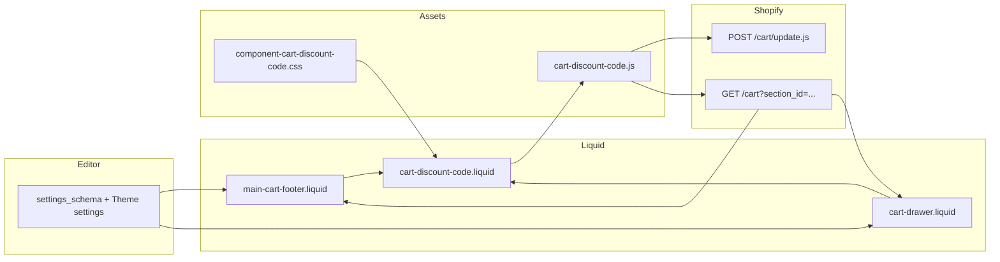

# Cupom de desconto no carrinho (Cart Discount Code)

## 1. Visão geral da funcionalidade

### O que foi implementado

- Campo de texto para o cliente informar um código de cupom.
- Botão **Aplicar** que envia o código para a **Cart API** da Shopify (`POST /cart/update.js` com corpo JSON `{ "discount": "CODIGO" }`).
- Botão **Remover** que envia `{ "discount": "" }` para retirar descontos aplicados via esse mecanismo.
- Área de feedback com `aria-live` para sucesso e erro, alinhada ao padrão de campos do Dawn.
- Estados de carregamento no botão aplicar (spinner + `aria-busy`).
- Validação de **campo vazio** com mensagem configurável.
- Após sucesso, atualização do HTML do carrinho via **Section Rendering API** (`GET /cart?section_id=...`), como o próprio Dawn faz ao alterar quantidades.
- Configurações no **Theme Editor** (grupo **Cart** nas configurações globais do tema).
- Textos padrão em **locales** (`sections.cart.discount_code.*`) com fallback para os textos das configurações.

### Objetivo da solução

Entregar uma experiência de cupom no carrinho **compatível com lojas Shopify reais**, sem backend customizado, sem simular totais no front e sem depender de APIs inexistentes no tema. O desconto passa a existir no carrinho somente quando a plataforma confirma isso na resposta do `cart/update.js` e/ou nos dados do carrinho retornados.

---

## 2. Limitações reais da Shopify

### Como cupons e descontos se comportam em temas

- O tema **não calcula** descontos no navegador. Quem define preço final, alocações e regras é a Shopify (descontos automáticos, códigos, scripts Plus, etc.).
- A **Cart Ajax API** documentada permite **atualizar descontos no carrinho** com `POST /cart/update.js` e a propriedade `discount` (string do código; string vazia remove). Referência: [Cart API – Update discounts](https://shopify.dev/docs/api/ajax/reference/cart#post-cart-update-js).
- A URL **`/discount/CODIGO?redirect=/cart`** continua sendo o mecanismo clássico baseado em redirecionamento e cookie. Esta implementação **prioriza** `cart/update.js` porque:
  - evita reload completo da página;
  - devolve o JSON do carrinho para validação imediata;
  - combina com o fluxo já usado pelo Dawn (fetch + atualização de seções).

### Abordagem escolhida

1. **Aplicar / remover** via `fetch` para `routes.cart_update_url` (equivalente a `/cart/update.js`) com `fetchConfig()` do Dawn.
2. **Validar sucesso** apenas se houver “evidência” no objeto carrinho retornado:
   - `total_discount > 0`, ou
   - `cart_level_discount_applications.length > 0`, ou
   - algum item com `line_level_discount_allocations`, ou
   - `discount_codes` com entradas aplicáveis quando presentes.
3. Se a resposta HTTP indicar erro (`!response.ok`), exibir `description` / `message` da API quando existirem; caso contrário, usar a mensagem de erro configurável.
4. **Atualizar a UI** buscando as seções `main-cart-items`, `main-cart-footer` e, se existir, `cart-drawer`, para que totais e listagens reflitam `line_item` e `cart_level_discount_applications` reais.

### Por que não “inventar” desconto no total

Alterar apenas o texto do total no DOM sem dados da Shopify geraria inconsistência com checkout e suporte. Por isso o feedback de sucesso só é mostrado após evidência no retorno da API (e a UI dos preços vem das seções re-renderizadas).

---

## 3. Arquivos criados e alterados

### Criados

| Arquivo | Função |
|--------|--------|
| `snippets/cart-discount-code.liquid` | Marcação do componente (`<cart-discount-code>`), labels, input, botões, região de feedback, dados para o JS via `data-*`. |
| `assets/cart-discount-code.js` | Custom element: aplicar/remover cupom, validação, `sessionStorage` para manter mensagem de sucesso após re-render das seções, `publish` do evento de carrinho, refresh das seções. |
| `assets/component-cart-discount-code.css` | Estilos do bloco (grid do campo + botão, loading, feedback). |
| `docs/cart-discount-code.md` | Esta documentação. |

### Alterados

| Arquivo | O que mudou |
|---------|-------------|
| `config/settings_schema.json` | Novas opções no grupo **Cart**: habilitar campo, títulos, placeholder, textos de sucesso/erro/vazio, rótulos dos botões. |
| `locales/en.default.schema.json` | Rótulos e infos do schema (inglês) para as novas configurações. |
| `locales/pt-BR.schema.json` | Idem em português (Brasil). |
| `locales/en.default.json` | Strings `sections.cart.discount_code.*` para fallback/tradução. |
| `locales/pt-BR.json` | Idem em pt-BR. |
| `layout/theme.liquid` | Inclusão condicional do CSS e do JS quando `settings.enable_cart_discount_code` está ativo. |
| `sections/main-cart-footer.liquid` | Comentário de feature; render do snippet na página do carrinho (carrinho não vazio). |
| `sections/main-cart-items.liquid` | Comentário apontando onde a feature se integra (footer + snippet). |
| `snippets/cart-drawer.liquid` | Comentário de feature; render do snippet no drawer (carrinho não vazio). |
| `assets/cart.js` | Ignorar `cart-discount-code` no `subscribe` de `cart-update` para não refazer fetch das seções em duplicidade. |

---

## 4. Como os arquivos conversam entre si

1. **Theme Editor** preenche textos e o checkbox de habilitar.
2. **Liquid** renderiza o snippet com `data-success-template`, `data-error-message`, `data-empty-message` escapados.
3. **JS** chama a Cart API; em sucesso grava feedback em `sessionStorage`, atualiza seções; no próximo paint o Liquid re-renderiza o snippet e o `connectedCallback` relê o `sessionStorage` para reapresentar a mensagem de sucesso.
4. **CSS** mantém o layout alinhado a `field`/`button` do Dawn.

---

## 5. Conceitos técnicos

| Conceito | Uso nesta feature |
|----------|-------------------|
| **Liquid** | Render condicional (`cart != empty`), textos com fallback (`settings` → `t`), escape em atributos. |
| **Schema / settings** | `settings_schema.json` expõe campos no grupo Cart; valores em `settings.*` no Liquid. |
| **Locales** | Chaves em `sections.cart.discount_code` para tradução e mensagens padrão. |
| **Objeto carrinho (Ajax JSON)** | Propriedades como `total_discount`, `items`, `cart_level_discount_applications`, `discount_codes` conforme documentação atual da Cart API. |
| **Desconto em item vs pedido** | Linha: `line_level_discount_allocations` nos itens; pedido: `cart_level_discount_applications` — a verificação de sucesso considera ambos sem fixar nomes de tipos de desconto no front. |
| **Custom element** | Encapsula comportamento e seletores; evita poluir `cart.js`. |
| **Pub/Sub** | `publish(PUB_SUB_EVENTS.cartUpdate, …)` para outros módulos que já escutam atualizações do carrinho. |

---

## 6. Decisões técnicas

| Decisão | Motivo |
|---------|--------|
| **Cart API em vez de só `/discount/URL`** | UX sem reload completo; resposta JSON permite validar e mensagens de erro da plataforma. |
| **`sessionStorage` para mensagem de sucesso** | O re-render das seções substitui o DOM do footer/drawer; sem persistir o feedback, a mensagem sumiria após o fetch. |
| **Ignorar `cart-discount-code` em `cart.js`** | O próprio script já atualiza as seções; evita segunda requisição redundante em `CartItems.onCartUpdate`. |
| **Configurações no grupo Cart (global)** | O drawer é um snippet sem ``; um bloco só na seção da página do carrinho não configuraria o drawer. O grupo Cart atinge **página do carrinho + drawer** com uma única fonte de verdade. |
| **Snippet compartilhado** | Uma única marcação para página e drawer, com `context` (`page` / `drawer`) para prefixos de `id`. |
| **Liquid + `GET /cart.js` para o botão Remover** | No servidor, `cart.discount_codes` nem sempre reflete cupons aplicados via Cart API após um **reload** da página; `cart_level_discount_applications` com `type == discount_code` costuma refletir. O Liquid usa ambos + linhas; ao montar o componente, o JS chama **`GET /cart.js`** e alinha `hidden` do remover com `cartHasDiscountCodeApplied` (mesma lógica da API Ajax). |

### Alternativas

- **Somente link para `/discount/CODE?redirect=/cart`**: mais simples, porém pior UX (reload) e validação menos rica no retorno imediato.
- **Bloco só em `main-cart-footer`**: não cobriria o drawer sem duplicar configuração ou refatorar o drawer para section com schema.

### Riscos e limitações

- Descontos **somente de frete** ou casos em que o valor alocado no carrinho é zero podem ter comportamento específico; a documentação da Shopify e testes na loja real são essenciais.
- Lojas com **Shopify Scripts** ou regras muito específicas devem validar fluxo em staging.
- **Múltiplos códigos**: a API permite lista separada por vírgula; esta UI aplica um código por vez (comportamento alinhado ao campo único do requisito).

---

## 7. Guia de QA

### Habilitar / desabilitar

1. Admin Shopify → **Online Store → Themes → Customize**.
2. **Theme settings** (ícone de engrenagem) → **Cart**.
3. Alternar **Show discount code field** (`enable_cart_discount_code`).
4. Salvar.

### Alterar textos

1. No mesmo grupo **Cart**, editar heading, placeholder, botões, mensagens de sucesso (use `{{ code }}` no texto de sucesso onde o código deve aparecer), erro e campo vazio.
2. Salvar e testar na vitrine.

### Cupom válido (pedido ou produto)

1. Criar um código de desconto no admin (**Discounts**) que se aplique ao carrinho de teste.
2. Adicionar produtos que atendam à regra, abrir carrinho (página ou drawer).
3. Digitar o código → **Aplicar**.
4. **Esperado**: mensagem de sucesso (com código se o template tiver `{{ code }}`), totais/atualizações visíveis nas linhas ou no bloco de descontos do pedido, botão **Remover** visível.

### Cupom inválido ou expirado

1. Digitar um código inexistente ou inválido para o carrinho atual.
2. **Esperado**: mensagem de erro; totais inalterados em relação ao estado anterior à tentativa.

### Remover cupom

1. Com cupom aplicado, clicar **Remover**.
2. **Esperado**: desconto some dos totais/listagens após o refresh das seções; mensagem de feedback não precisa permanecer (comportamento neutro).

### Mensagens de feedback

- **Sucesso**: região com `role="status"` e estilo de sucesso.
- **Erro**: `role="alert"` para leitores de tela.
- **Campo vazio**: tentar **Aplicar** sem preencher → mensagem de “empty” configurável.

### Edge cases

| Cenário | Esperado |
|---------|----------|
| Carrinho vazio | Campo de cupom **não** é exibido (condição Liquid `cart != empty`). |
| Aplicar duas vezes o mesmo código válido | Resposta ainda com evidência de desconto → sucesso (ou mensagem consistente com a API). |
| Rede / erro de servidor | Mensagem de erro genérica configurável; botão volta do estado de loading. |
| Página do carrinho + drawer aberto | Dois blocos de cupom podem existir; ambos podem exibir o mesmo feedback após aplicar (sessionStorage lido por ambos antes de limpar). |

---

## 8. Resumo final

### Entregue

- Componente isolado (`cart-discount-code` + JS + CSS), integrado à **página do carrinho** e ao **cart drawer**.
- Aplicação/remoção alinhada à **Cart API** oficial, com validação a partir dos dados retornados e re-render das seções Dawn.
- **Configurações globais** no Theme Editor e **locales** para i18n.
- **Documentação** e **comentários de rastreabilidade** nos pontos de integração.

### Pontos de atenção

- Testar sempre com descontos reais criados no admin da loja (incluindo regras por coleção, quantidade mínima, etc.).
- Manter o tema atualizado com o Dawn de referência ao fazer merge futuro; conflitos podem ocorrer em `theme.liquid`, `cart.js` e `cart-drawer.liquid`.
- Se a loja usar apps que também alteram o carrinho, validar compatibilidade dos eventos `cart-update` e da Section Rendering API.
