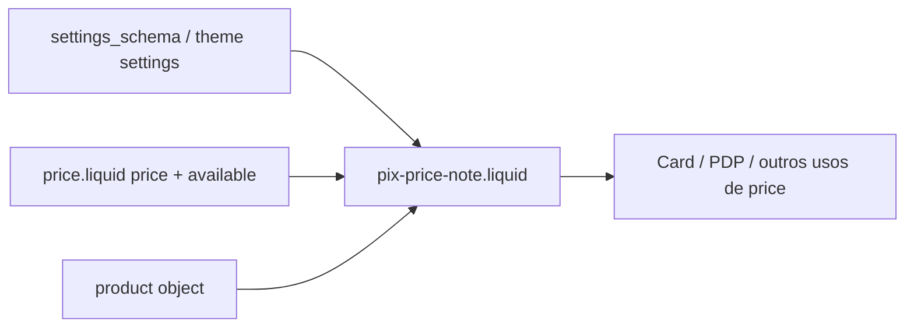

# Preço com desconto PIX (PIX Discount Display)

## 1. Visão geral

Esta funcionalidade adiciona uma **linha complementar** de preço estimado para pagamento via **PIX**, com base numa **percentagem configurável globalmente** nas definições do tema. O **preço principal do Dawn** (`snippets/price.liquid`) **não é substituído**; o cliente continua a ver o preço nativo (normal, promoção, intervalos, etc.) e, quando aplicável, uma segunda linha com o valor já descontado e a menção à economia percentual.

**Objetivo:** incentivar pagamento à vista com PIX, com configuração única para toda a loja e comportamento **consistente** entre **card de produto** e **PDP**, alinhado à arquitetura de preços do Dawn.

**Importante:** o valor é **meramente informativo** na vitrine; **não altera** carrinho, checkout nem totais na Shopify.

---

## 2. Regra de negócio

### Configuração

- **Onde:** `Configuração do tema` → grupo **“Desconto PIX”** (schema em `config/settings_schema.json`, chaves `t:settings_schema.pix_discount.*` nas traduções de schema).
- **Campos:**
  - **Ativar** (`pix_discount_enabled`): mostrar ou ocultar a linha em todo o tema.
  - **Percentagem** (`pix_discount_percent`): inteiro **0–50%** (padrão do schema: **5%**).

### Cálculo

- **Fórmula (em centavos da moeda da loja):**
  - `desconto_centavos = round_half_up(price * percent / 100)`
  - Implementação Liquid: `discount_cents = price | times: pct | plus: 50 | divided_by: 100` (arredondamento **half-up** para o centavo mais próximo).
  - `pix_cents = price - discount_cents`, com piso em **0** se algum edge case produzir negativo.
- **Base do `price`:** o mesmo número em centavos que o snippet `price.liquid` já atribuiu a `price` a partir de `target` (produto ou variante), garantindo alinhamento com o que o cliente vê.

### Quando aparece

A linha só é renderizada quando **todas** as condições se verificam:

1. `settings.pix_discount_enabled` é verdadeiro.
2. `settings.pix_discount_percent > 0`.
3. `price` definido e `> 0`.
4. `available` é verdadeiro (variante/produto disponível conforme o Dawn).
5. `product != blank` (evita placeholders sem produto).
6. **Não** está ativo `product.quantity_price_breaks_configured?` (preços por volume — a linha PIX fica oculta para não conflituar com essa UX).

### Card vs PDP

- **Card:** o Dawn chama `` **sem** `use_variant: true` → o preço base segue a lógica nativa do card (agregado / “a partir de”, etc.), e a linha PIX usa o **mesmo** `price`/`available`.
- **PDP:** o bloco de preço usa `use_variant: true` → `target` é a **variante selecionada** (ou primeira disponível); a linha PIX usa esse mesmo `price`. Quando o JavaScript do Dawn substitui o HTML do bloco `#price-{section}` ao mudar de variante, **a linha PIX é recalculada** porque vem no mesmo HTML devolvido pelo servidor.

### Texto

- Chave de tradução: `products.product.pix_price_html` (ex.: em `locales/pt-BR.json`: `{{ price }} no PIX (economia de {{ percent }}%)`).
- `{{ price }}` é o valor formatado (`money` / `money_with_currency` conforme `settings.currency_code_enabled`).
- `{{ percent }}` repete a percentagem configurada (coerente com o desconto aplicado no cálculo).

---

## 3. Arquitetura da solução

### Encaixe no Dawn

- **Configuração global** no `settings_schema.json` (grupo próprio entre **formato de moeda** e **carrinho**), porque afeta **vários sítios** (cards, PDP, qualquer sítio que renderize `price`).
- **Um único snippet** de apresentação, `snippets/pix-price-note.liquid`, encapsula regras de exibição e cálculo.
- **Um único ponto de integração** no renderizador de preços: `snippets/price.liquid`, **depois** de `
` do `.price__container` e **antes** dos badges, para não interferir com compare-at, badges ou estrutura semântica interna do preço.
- **CSS** mínimo em `assets/component-pix-price.css`, carregado em `layout/theme.liquid` após `base.css`.
- **Sem JavaScript adicional** para variantes: reutiliza o mecanismo nativo de atualização do bloco de preço na PDP.

### Partilha entre card e PDP

Ambos usam ``. O `render 'pix-price-note'` dentro de `price.liquid` recebe sempre o `price` e `available` já coerentes com o contexto (`use_variant` ou não), evitando duplicar a lógica de escolha de variante.

---

## 4. Ficheiros criados e alterados

| Ficheiro | Função na feature |
|----------|-------------------|
| `config/settings_schema.json` | Novo grupo de settings: `pix_discount_enabled`, `pix_discount_percent`. |
| `locales/en.default.schema.json` | Traduções do editor para o grupo “PIX discount” (schema). |
| `locales/pt-BR.schema.json` | Idem em português (Brasil). |
| `locales/*.schema.json` (outros idiomas) | Entrada `settings_schema.pix_discount` com textos em inglês para validação de chaves em todos os ficheiros de schema do tema. |
| `locales/pt-BR.json` | Cópia `products.product.pix_price_html` para o formato pedido em PT-BR. |
| `locales/en.default.json` e demais `locales/*.json` | Chave `products.product.pix_price_html` (fallback EN nos restantes). |
| `snippets/pix-price-note.liquid` | **Novo** snippet: condições, cálculo, markup acessível. |
| `snippets/price.liquid` | `render` do `pix-price-note` após o contentor de preço. |
| `assets/component-pix-price.css` | **Novo** asset: espaçamento, peso de fonte, ligeiro destaque em `.price--large`. |
| `layout/theme.liquid` | Inclusão global de `component-pix-price.css`. |
| `docs/pix-discount-display.md` | Esta documentação. |

---

## 5. Como os ficheiros “conversam”

1. O lojista define **ativar** e **%** no editor de tema → valores em `settings`.
2. Qualquer template que renderize `price.liquid` passa `product` (e flags como `use_variant`).
3. `price.liquid` calcula `price`, `available`, etc., como no Dawn original.
4. `pix-price-note.liquid` lê `settings.pix_discount_*` + `price` + `available` + `product` e, se válido, imprime a linha com texto de `products.product.pix_price_html`.
5. Na **PDP**, ao mudar de variante, o Dawn volta a pedir o HTML da secção; o snippet `price` é gerado de novo → **nova** linha PIX para a variante atual.

---

## 6. Conceitos técnicos (resumo)

| Conceito | Uso nesta feature |
|----------|-------------------|
| `settings_schema.json` | Declara o grupo global e os IDs `pix_discount_*`. |
| Configuração global do tema | `settings.pix_discount_enabled` / `settings.pix_discount_percent` acessíveis em qualquer Liquid. |
| `price` (Liquid) | Valor em **centavos** da variante ou agregado conforme `target`. |
| Cálculo de desconto | Percentagem sobre `price`; arredondamento half-up do desconto em centavos. |
| `money` / `money_with_currency` | Formatação consistente com o resto do tema. |
| Card de produto | `render 'price'` sem `use_variant` → mesmo `price` que o Dawn mostra no card. |
| PDP | `use_variant: true` → preço da variante selecionada; atualização por **re-render** do bloco. |
| Liquid | Toda a lógica de negócio no snippet; sem duplicação no card/PDP. |
| JS | Não acrescentado: evita dessincronizar com o motor de variantes do Dawn. |
| Responsividade | Classes `caption` + regras simples; em `.price--large` aumenta ligeiramente o tamanho no desktop. |
| Acessibilidade | `role="note"` no contentor; a informação não depende só de cor (texto explícito + percentagem). |

---

## 7. Decisões técnicas

| Decisão | Motivo |
|---------|--------|
| Settings **globais** no `settings_schema` | Um único ponto de verdade; reflete em todos os `render 'price'` sem duplicar por secção. |
| Inserção **após** `.price__container` | Preserva markup interno, badges e `compare_at_price` do Dawn. |
| Reutilizar o `price` já calculado em `price.liquid` | Garante paridade com o preço mostrado e evita bugs de variante. |
| Ocultar com **volume pricing** | O preço exibido pode seguir regras de quantidade; a linha PIX fixa % sobre um único `price` seria enganosa. |
| Arredondamento **half-up** no desconto | Comportamento previsível em centavos; documentado no snippet. |
| Traduções schema em **EN** nos outros idiomas | Chaves presentes em todos os `*.schema.json` para consistência com validações de tema; PT-BR e EN default têm textos dedicados. |
| **Sem** JS extra | Menos superfície de bugs e alinhamento automático com o fetch de secção do Dawn. |

**Alternativas consideradas:** secção dedicada só na PDP (rejeitada: quebra consistência com o card); snippet separado para card e PDP (rejeitada: duplicação desnecessária); JS a ouvir `variant` (rejeitada: redundante se o HTML do preço já é substituído).

**Limitações:** não integra gateways PIX reais; não mostra linha com percentagem 0 ou desativada; com volume pricing, fica oculta.

---

## 8. Guia de QA

### Configurar

1. **Tema** → **Personalizar** → **Configurações do tema** (ícone de engrenagem).
2. Localizar o grupo **Desconto PIX** / **PIX discount**.
3. Ativar **Mostrar preço com desconto PIX** (ou equivalente).
4. Definir **Percentagem de desconto PIX** (ex.: **5**).

### Validar no card

1. Coleção ou página inicial com grelha de produtos.
2. Confirmar que o **preço principal** é o de sempre.
3. Abaixo, linha extra com valor menor e texto com **economia de X%** (se idioma PT-BR).

### Validar na PDP

1. Abrir um produto; confirmar linha abaixo do preço principal no formato configurado em traduções.
2. **Produto simples:** alterar percentagem nas settings e recarregar — valor PIX deve acompanhar.

### Validar cálculo

1. Escolher produto com preço conhecido (ex.: R$ 100,00 → `10000` centavos).
2. Com **5%**, desconto = `500` centavos; preço PIX = `9500`.
3. Testar preço ímpar (ex.: R$ 9,99) e confirmar arredondamento do **desconto** ao centavo mais próximo.

### Variantes

1. Produto com várias variantes e preços diferentes.
2. Na PDP, mudar seletor de variante.
3. Esperado: preço principal e linha PIX **ambos** atualizam.

### Mobile

1. Redimensionar ou usar dispositivo estreito.
2. Linha não deve quebrar grelha nem sobrepor badges; texto legível.

### Edge cases

| Cenário | Resultado esperado |
|---------|---------------------|
| Desconto desligado | Sem linha PIX. |
| Percentagem **0** | Sem linha (condição `> 0`). |
| Variante **indisponível** | `available` falso → sem linha. |
| `price` 0 | Sem linha. |
| Volume pricing ativo | Sem linha. |
| Placeholder sem `product` | `price.liquid` não chama o snippet. |

---

## 9. Resumo final

**Entregue:** configuração global, snippet reutilizável, integração única em `price.liquid`, CSS global, traduções de produto e de schema, documentação.

**Pontos de atenção para a Tech Lead**

- A linha é **estimativa de marketing**, não preço contratual no checkout.
- **Volume pricing:** omitido de propósito.
- **Card** com `price_varies`: o Dawn pode mostrar “A partir de…”; o PIX usa o **mesmo** `price` subjacente àquela renderização (comportamento alinhado ao snippet nativo, não inventado).
- Ficheiros `locales/*schema.json` (exceto `en.default` / `pt-BR`) usam **inglês** no bloco `pix_discount` para cumprir paridade de chaves; o conteúdo visível ao lojista em FR/DE/etc. pode ser refinado depois com traduções nativas.

---

*Documento gerado para revisão técnica da feature **PIX Discount Display** no tema Dawn deste repositório.*
